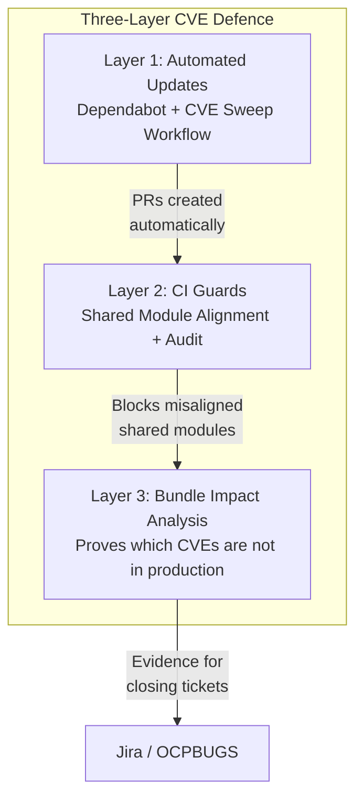
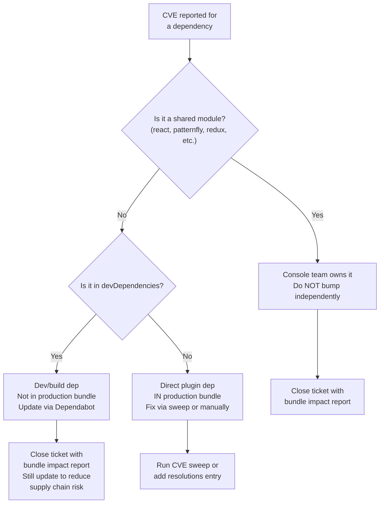
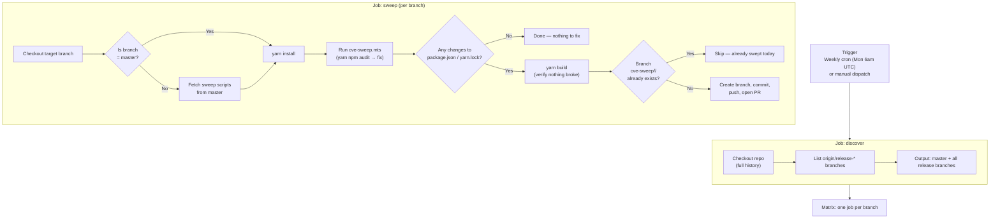
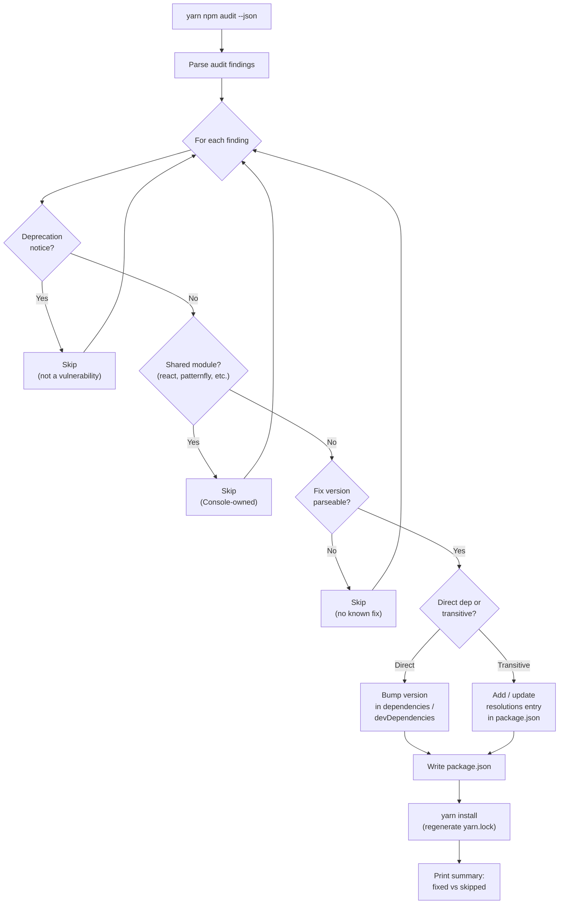
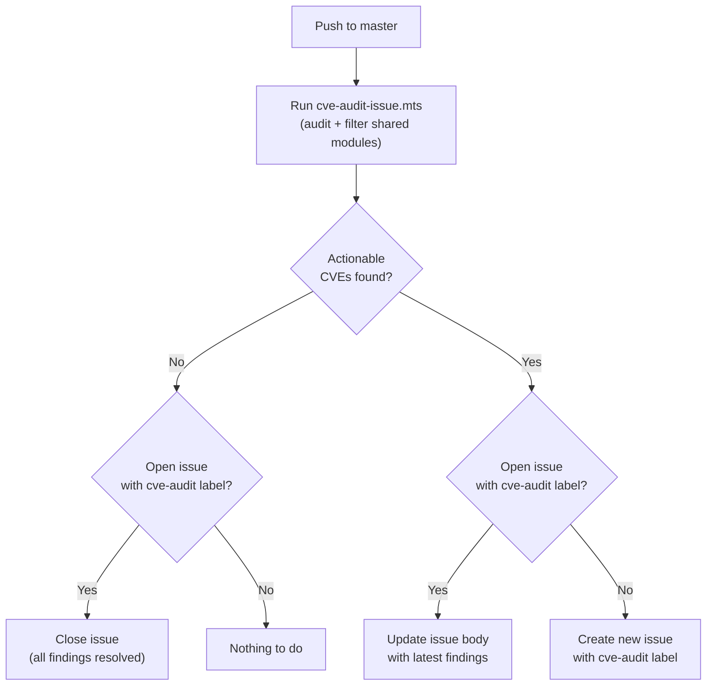
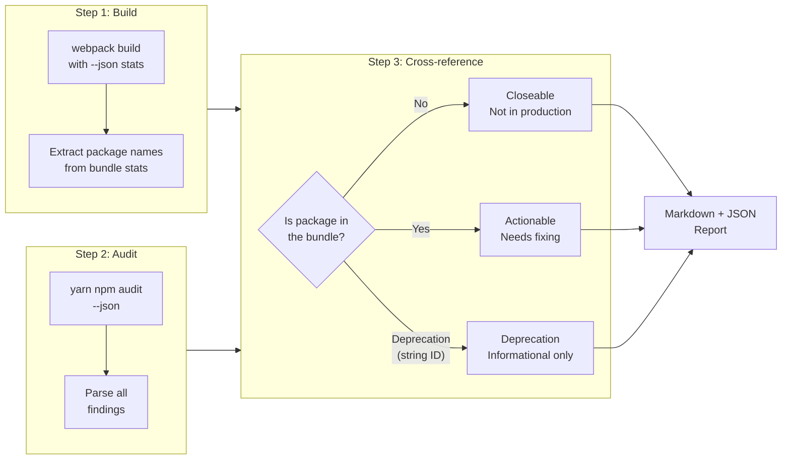
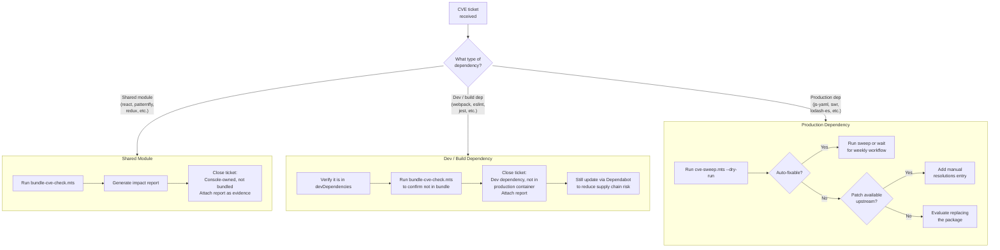
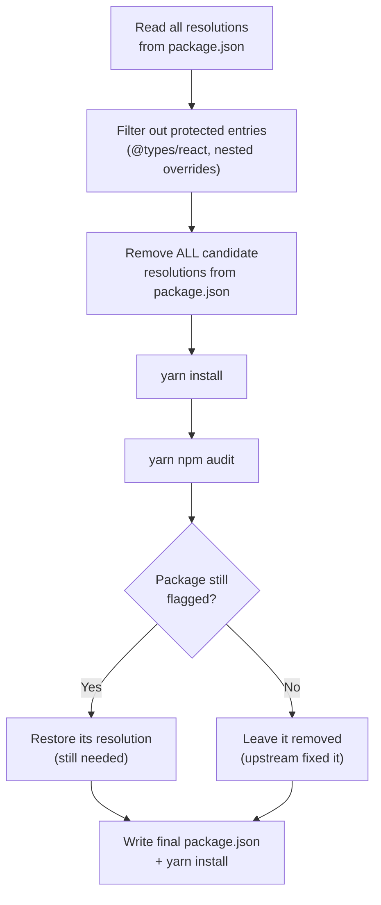
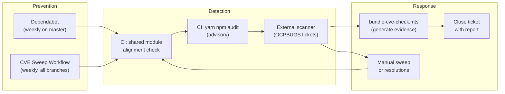

# CVE Handling Process for odf-console

## Overview

odf-console is a dynamic plugin that runs inside the OpenShift Console runtime via Module Federation. This architecture means many dependencies are **shared modules** — provided by the Console at runtime and never bundled into the plugin. CVEs in shared modules are the Console team's responsibility, not ours.

Our CVE handling has three layers:

1. **Automated dependency updates** — Dependabot + CVE sweep workflow
2. **CI guards** — shared module alignment check + vulnerability audit
3. **Bundle impact analysis** — proves which CVEs don't affect the production build

### Architecture at a Glance



## Dependency Categories

| Category               | Examples                                          | Who Owns CVEs          | How Updated                                            |
| ---------------------- | ------------------------------------------------- | ---------------------- | ------------------------------------------------------ |
| **Shared modules**     | `react`, `react-router`, `@patternfly/*`, `redux` | OpenShift Console team | Frozen to match Console SDK; never bump independently  |
| **Direct plugin deps** | `js-yaml`, `@aws-sdk/*`, `lodash-es`, `swr`       | odf-console team       | Dependabot weekly on master; CVE sweep on all branches |
| **Dev/build deps**     | `webpack`, `eslint`, `jest`, `typescript`         | odf-console team       | Dependabot weekly; not in production bundle            |

### Dependency Ownership Decision Flow



### Shared Modules (Console-Provided)

These are externalized at runtime via `ConsoleRemotePlugin` and Module Federation. The authoritative list is read at runtime from the SDK:

```
node_modules/@openshift-console/dynamic-plugin-sdk-webpack/lib/shared-modules/shared-modules-meta.js
```

All three CVE scripts (`cve-sweep.mts`, `bundle-cve-check.mts`, `check-shared-modules.mts`) read from this source rather than maintaining their own hardcoded lists. A fallback list in `scripts/lib/get-shared-modules.mts` is used only when the SDK is not installed.

Additionally, PatternFly component packages (`@patternfly/react-core`, `@patternfly/react-icons`, `@patternfly/react-table`) use dynamic module sharing — individual components are shared at the component level via the Console runtime. The scripts catch these via a `@patternfly/*` prefix match.

**Policy:** Never bump these independently. Their versions must match the Console SDK's `peerDependencies`. The `check-shared-modules.mts` CI guard enforces this.

**When a CVE is filed against a shared module:** Close it with justification that the package is Console-provided and not bundled by the plugin. Use the bundle impact report (see below) as evidence.

## Automation

### Dependabot (`.github/dependabot.yml`)

- Runs weekly on `master` only
- Updates direct and dev dependencies via grouped PRs
- Ignores all shared modules (explicit ignore list)
- Uses `versioning-strategy: increase` to update `package.json` ranges, not just the lock file
- Also keeps GitHub Actions versions current

### CVE Sweep Workflow (`.github/workflows/cve-sweep.yml`)

- Runs weekly (Monday 6am UTC) or on-demand via `workflow_dispatch`
- **Auto-discovers release branches** — no manual branch list to maintain
- Fetches the latest sweep scripts from `master` so release branches don't need them
- Handles both direct deps and `resolutions` entries (transitive deps)
- Skips shared modules automatically
- **Verifies `yarn build` succeeds** before creating a PR
- Skips PR creation if a sweep branch for today already exists (safe to re-run)
- Creates a PR per branch with a summary of what was fixed



**Why per-branch instead of backporting?** Release branches have divergent dependency trees (different `resolutions` entries, different transitive dep versions). Cherry-picking from master fails because the `package.json` and `yarn.lock` differ significantly between branches.

### CVE Sweep Script Logic (`scripts/cve-sweep.mts`)



### CI Guards (`.github/workflows/frontend-build.yml`)

Two checks run on every PR:

1. **Shared module alignment** (`scripts/check-shared-modules.mts`) — fails if installed shared module versions don't satisfy the Console SDK's `peerDependencies`
2. **Vulnerability audit** (`yarn npm audit --environment production --severity moderate`) — reports known CVEs in production dependencies (advisory, does not block merge)

### CVE Audit Issue (push to `master` only)

On every push to `master`, a separate `cve-audit` job runs `scripts/cve-audit-issue.mts` to detect moderate+ CVEs in production dependencies. It automatically filters out shared modules and deprecation notices, then manages a single rolling GitHub issue:

- **New CVEs found, no existing issue** → creates an issue with the `cve-audit` label
- **New CVEs found, issue already open** → updates the existing issue body with fresh findings
- **No CVEs found, issue is open** → closes the issue with a resolution comment

This ensures actionable CVEs are always visible without creating duplicate issues.



## Bundle Impact Analysis

### Purpose

Many CVE scanner tickets (e.g., OCPBUGS) flag vulnerabilities in packages that are not actually present in the production bundle. Common cases:

- **react-router SSR/RSC CVEs** — the plugin uses declarative routing inside the Console shell; SSR, RSC, and server-side features are never used
- **webpack-dev-server** — dev dependency, never ships in the container image
- **Shared module CVEs** — Console-provided, externalized at runtime

### How It Works



### Generating a Report

```bash
# Full report for the odf plugin
yarn tsx scripts/bundle-cve-check.mts

# Specific plugin and severity
yarn tsx scripts/bundle-cve-check.mts --plugin mco --severity high

# With machine-readable JSON output
yarn tsx scripts/bundle-cve-check.mts --json
```

This builds the plugin with webpack, extracts the list of packages actually included in the production bundle, cross-references against `yarn npm audit`, and generates a markdown report categorizing each finding as:

- **Closeable** — not in the production bundle (with justification)
- **Actionable** — in the production bundle (needs fixing)
- **Deprecation** — informational only

The report is saved as `cve-report-<plugin>-<date>.md` and can be attached to Jira tickets as evidence when closing CVEs. With `--json`, a companion `.json` file is produced for programmatic consumption.

### Manual Verification

To manually check if a specific package is in the bundle:

```bash
# Build the plugin
yarn build

# Check if the package appears in the output
grep -r "packageName" plugins/odf/dist/ || echo "Not in bundle"
```

## Handling Specific Scenarios

### CVE Triage Decision Tree

Use this flowchart when a CVE ticket lands to decide what action to take:



### Scanner files a CVE against a shared module

1. Check the shared modules list above
2. Run `yarn tsx scripts/bundle-cve-check.mts` to generate evidence
3. Close the ticket with: "Package is a Console-provided shared module, externalized at runtime via Module Federation. Not bundled by the plugin. See attached report. CVE ownership belongs to the OpenShift Console team."

### Scanner files a CVE against a dev/build dependency

1. Verify it's in `devDependencies` (not `dependencies`)
2. Run `yarn tsx scripts/bundle-cve-check.mts` to confirm it's not in the bundle
3. Close with: "Package is a development dependency, not included in the production container image. See attached report."
4. Still update it via Dependabot to prevent supply chain risk during builds

### Scanner files a CVE against a production dependency

1. Run `yarn tsx scripts/cve-sweep.mts --dry-run` to see if the sweep can fix it
2. If fixable: run the sweep or wait for the weekly workflow
3. If not fixable (no patch available): add a `resolutions` entry manually, or evaluate replacing the package

### New dependency being added

1. Check if it's a shared module — if so, use the Console-provided version
2. Add to `devDependencies` unless it's needed at runtime
3. Prefer packages with active maintenance and small dependency trees
4. Run `yarn npm audit` after adding to check for known issues

## Resolutions Block

The `resolutions` field in `package.json` force-pins transitive dependency versions to fix CVEs in packages we don't directly control. The CVE sweep workflow manages these automatically.

### How Pruning Works



To prune stale resolutions (entries where upstream has already updated past the forced version):

```bash
# Preview what would be pruned
yarn tsx scripts/cve-sweep.mts --prune --dry-run

# Actually prune
yarn tsx scripts/cve-sweep.mts --prune
```

The `--prune` flag removes all candidate resolutions, re-installs, re-audits, and only restores resolutions that are still needed. Non-CVE resolutions (type overrides, nested dependency overrides) are never touched.

## Structured Output

Both scripts support `--json` for machine-readable output:

```bash
# Sweep — writes cve-sweep-result.json
yarn tsx scripts/cve-sweep.mts --json

# Bundle check — writes cve-report-<plugin>-<date>.json
yarn tsx scripts/bundle-cve-check.mts --json
```

The JSON output can be consumed by downstream tooling (Jira integration, Slack notifications, dashboards) without parsing markdown.

## End-to-End Workflow Summary



## Scripts Reference

| Script                               | Purpose                                                          |
| ------------------------------------ | ---------------------------------------------------------------- |
| `scripts/lib/get-shared-modules.mts` | Shared utility — reads Console SDK shared module list at runtime |
| `scripts/check-shared-modules.mts`   | CI guard — verifies shared module versions match Console SDK     |
| `scripts/cve-sweep.mts`              | Automated CVE fixing — bumps direct deps and resolutions         |
| `scripts/bundle-cve-check.mts`       | Bundle impact report — proves which CVEs don't affect production |
| `scripts/cve-audit-issue.mts`        | CI audit — creates/updates a GitHub issue for actionable CVEs    |
